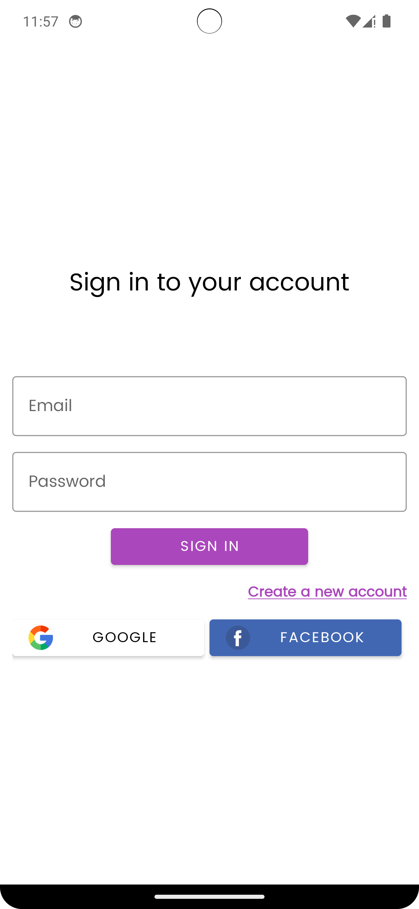
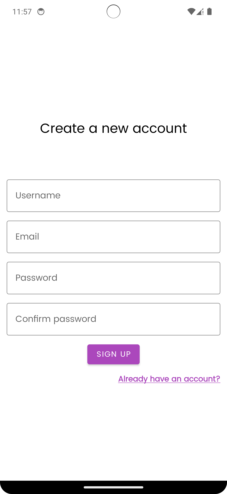

# QuestionAnswerApp

QuiZApp is an Android application designed to provide users with an interactive platform for participating in quizzes, creating their own quizzes, and competing with others. It offers a diverse range of categories and topics to cater to different interests and knowledge levels.

## Features

### User Authentication

Quizoholic ensures secure user authentication with Firebase Authentication. Users can create accounts, log in securely, and manage their profiles.

### Quiz Participation

Users can browse through various quizzes available on Quizoholic and participate in them. Each quiz is categorized based on topics and difficulty levels to make it easier for users to find quizzes of their interest.

### Quiz Creation

Registered users have the option to create and publish their own quizzes. They can choose the category, set the difficulty level, add questions and options, and publish the quiz for other users to participate in.

### Leaderboard

Quizoholic includes a leaderboard feature where users can view the top performers based on their scores in different quizzes. It provides a competitive aspect to the app and motivates users to improve their scores.

### Profile Management

Users can customize their profiles by adding profile pictures, updating their usernames, and viewing their quiz history. They can track their scores and see their performance over time.

## Screenshots

## Technologies Used

- **Android Studio**: The primary IDE used for Android app development.
- **Kotlin**: The programming language used for developing the Quizoholic app.
- **Firebase Authentication**: For user authentication and account management.
- **Firebase Realtime Database**: For storing quiz data, user profiles, and leaderboard information.
- **Firebase Storage**: For storing user profile pictures and quiz images.
- **Picasso**: A powerful image loading library used for displaying images in the app.
- **Material Components for Android**: UI components following Google's Material Design guidelines for a modern and intuitive user interface.

